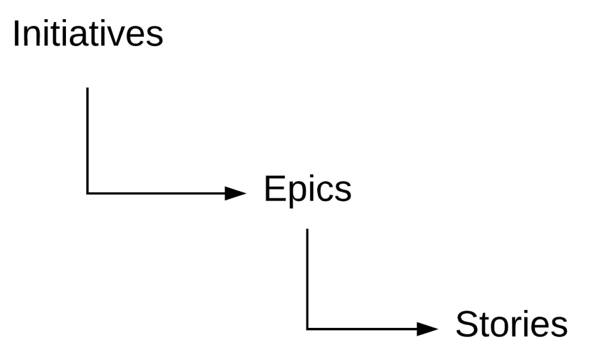
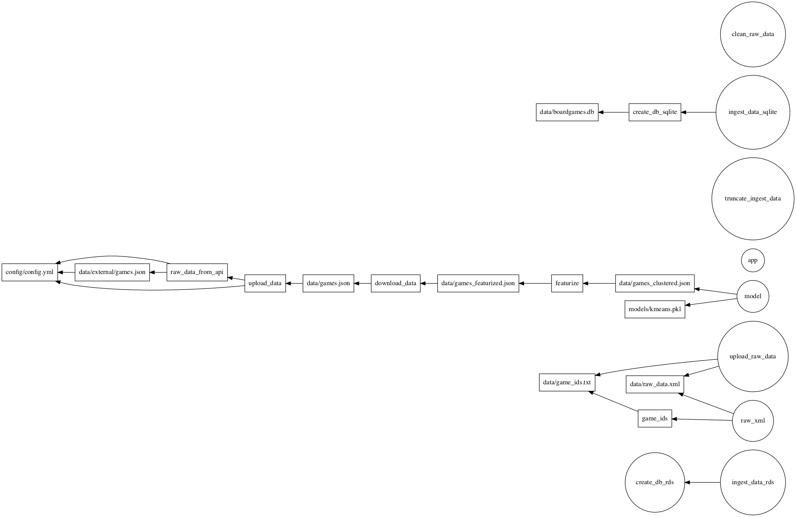
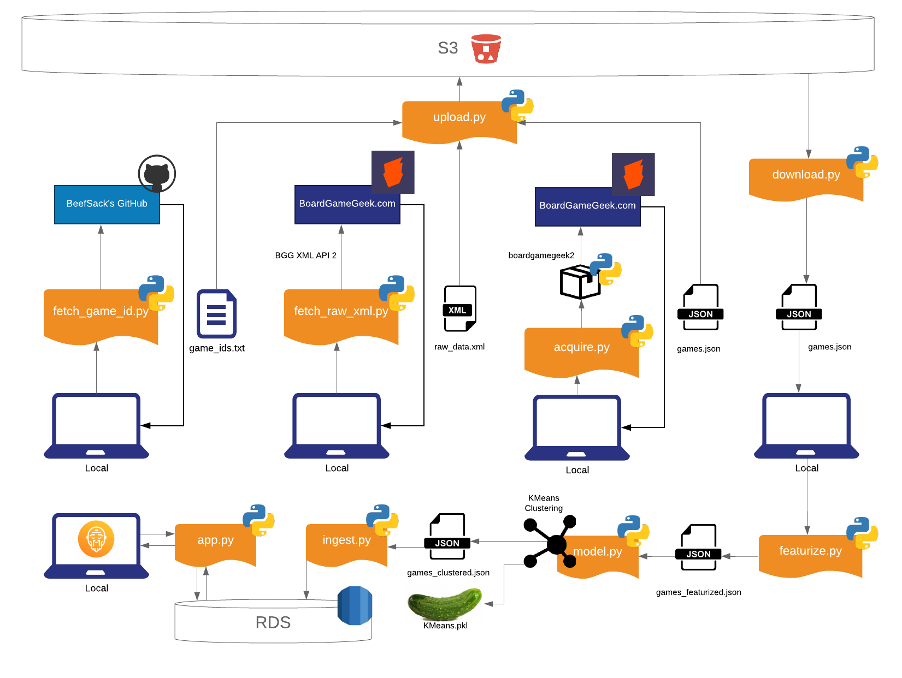

# BoardGameGuru: "The Guru to your Geek" 
# A Boardgame Recommendation Engine
## MSiA423 - Analytics Value Chain 
### Owner: Kristiyan Dimitrov; QA: Shreyashi Ganguly

<!-- toc -->

- [JUMP TO RECREATING THE APP](#quickest-way-to-recreate-app)
- [Project Charter](#project-charter)
  * [Vision](#vision)
  * [Problem Statement](#problem-statement)
  * [Mission](#mision)
  * [Success Criteria](#success-criteria)
- [Project Backlog](#project-backlog)
- [Project Icebox](#project-icebox)
- [Directory Structure](#directory-structure)
- [Quickest Way to Recreate the App](#quickest-way-to-recreate-app)
  * [1. Acquire data from API and upload to S3 bucket](#1-acquire-data-from-api-and-upload-to-s3-bucket)
  * [2. Download data from S3, generate features, and train clustering algorithm](#2-download-data-from-s3-generate-features-and-train-clustering-algorithm)
  * [3.1 SQLite](#31-using-sqlite)
  * [3.2 RDS MySQL](#32-using-rds)
  * [4. Run the Flask App](#4-run-the-flask-app)
- [Additional Functionality](#additional-functionality)
  * [1. Raw XML Data from API](#1-raw-xml-data-api)
  * [2. Querying my RDS Instance](#2-querying-my-rds-instance)
  * [3. Other Make Commands for a step-by-step workflow & Configurations](#3-other-make-commands-for-a-step-by-step-workflow--configurations)
  * [4. Diagrams](#4-diagrams)
  * [5. References](#5-references)

<!-- tocstop -->

## Project charter
### Vision
More people playing boardgames they love.

### Problem Statement
The number of boardgames published each year is [growing exponentially](https://medium.com/@Juliev/the-rise-of-board-games-a7074525a3ec).  
In 2015 alone, there were ~3,400 games published. That's almost 10 games _per day_.   
With such an overwhelming amount of games to choose from it can be difficult to find one you’ll like, even if you're a seasoned veteran of the boardgame world.

### Mission
Provide a boardgame recommendation system, which helps people discover games they will enjoy.

Currently, there are boardgame conferences, YouTube channels that review boardgames, boardgame stores, and ranking websites such as BoardGameGeek.com (“The IMDB of boardgames”).  
These help address the problem, but are either expensive, their opinions are subjective, or don't provide information in a structured way.

BoardGameGuru utilizes two data sources, both of which originate from BoardGameGeek.com:
- [Boardgamegeek XML API](https://boardgamegeek.com/wiki/page/BGG_XML_API#); [Boardgamegeek XML API 2](https://boardgamegeek.com/wiki/page/BGG_XML_API2)
- [Game ids for 17,313 games from beefsack's GitHub](https://raw.githubusercontent.com/beefsack/bgg-ranking-historicals/master/2019-07-08.csv)
### Success Criteria
- Business:
  - % positive user ratings of recommendations ("Did you like this recommendation?")
  - Click-Through-Rate to boardgamegeek.com and/or YouTube reviews (Users will be presented with links to learn more about the recommended game)
  - Avg. Time on Site and/or Avg. Number of Recommendations Requested (measured via Google Analytics)
- Statistical
  - % of variation explained (for Principal Components Analysis)
  - Clustering SSE (if the current categorization of games is not adequate)
  - Silhouette Score

## Project Backlog


Note: Sizing for each Story is present in {brackets}
0 points - quick chore;  
1 point ~ 1 hour (small);  
2 points ~ 1/2 day (medium);  
4 points ~ 1 day (large);  
8 points - big and needs to be broken down more when it comes to execution.

__Test Hypothesis: Boardgames can be categorized based on a few key characteristics and metrics. This will help us understand the landscape better and provide more adequate recommendations.__
- Source, Ingest and clean all 4 datasets
  - Download & import datasets {1}
  - Analyze missing values & outliers {1}
  - Remove irrelevant attributes and combine datasets where relevant {2}
- Investigate Main characteristics of boardgames via Dimensionality Reduction
  - Apply & Evaluate Principal Components Analysis {4}
  - Apply & Evaluate Exploratory Factor Analysis {4}
  - Generate new features based on previous output {2}
- Investigate utility of current categorization. Is there a better, more natural segmentation of boardgames, as opposed to the current categorization?
  - Apply & Evaluate K-Means and Gaussian Mixture Clustering {2}
  - Apply & Evaluate Hierarchical clustering with different linkage methods (Average/Single/Complete) {2}

__Make recommendations/predictions for boardgames the user will like.__
- Build recommendation system
  - Random & Popular (as benchmarks) {2}
  - Content Based Filtering {8}
  - User Based & Item Based Collaborative Filtering {8}
  - Compare recommendation systems via Statistical measures of success {2}

- Investigate Predictive Model as Alternative to Recommendation system
  - Apply K-Nearest-Neighbours to show similar boardgames {4}
  - Tune hyperparameter K {1}
  - Experiment with alternative similarity measures {2}

- Compare Recommendation System results with Predictive Model results

## Project Icebox

Visualize boardgame segmentation
- Add links to YouTube reviews for each game
- Allow users to rate the provided recommendations i.e. implement a feedback loop
- Implement Google Analytics on the website
- Build a D3 Visualization for the clustering segmentation
- Enable export of cluster segmentation

Disclaimer: a [similar tool](https://apps.quanticfoundry.com/recommendations/tabletop/boardgame/) already exists online. Assumption is that it works via KNN.


## Directory structure

```
├── README.md                         <- You are here
├── api
│   ├── static/                       <- CSS, JS files that remain static
│   ├── templates/                    <- HTML (or other code) that is templated and changes based on a set of inputs
│   ├── boot.sh                       <- Start up script for launching app in Docker container.
│   ├── Dockerfile                    <- Dockerfile for building image to run app  
│
├── config                            <- Directory for configuration files
│   ├── local/                        <- Directory for keeping environment variables and other local configurations that *do not sync** to Github
│   ├── logging/                      <- Configuration of python loggers
│   ├── flaskconfig.py                <- Configurations for Flask API
│
├── data                              <- Folder that contains data used or generated. Only the external/ and sample/ subdirectories are tracked by git.
│   ├── external/                     <- External data sources, usually reference data,  will be synced with git
│   ├── sample/                       <- Sample data used for code development and testing, will be synced with git
│
├── deliverables/                     <- Any white papers, presentations, final work products that are presented or delivered to a stakeholder
│
├── docs/                             <- Sphinx documentation based on Python docstrings. Optional for this project.
│
├── figures/                          <- Generated graphics and figures to be used in reporting, documentation, etc
│
├── models/                           <- Trained model objects (TMOs), model predictions, and/or model summaries
│
├── notebooks/
│   ├── archive/                      <- Develop notebooks no longer being used.
│   ├── deliver/                      <- Notebooks shared with others / in final state
│   ├── develop/                      <- Current notebooks being used in development.
│   ├── template.ipynb                <- Template notebook for analysis with useful imports, helper functions, and SQLAlchemy setup.
│
├── reference/                        <- Any reference material relevant to the project
│
├── src/                              <- Source data for the project
│
├── test/                             <- Files necessary for running model tests (see documentation below)
│
├── app.py                            <- Flask wrapper for running the model
├── run.py                            <- Simplifies the execution of one or more of the src scripts  
├── requirements.txt                  <- Python package dependencies
```
## Quickest way to recreate App

First, make sure you are connected to Northwestern VPN and Docker is running.  
Then, build the docker image by executing the following command in the root directory of the project
```bash
docker build -t python_env .
```

### 1. Acquire data from API and upload to S3 bucket
I've already done this, so if I've given you access to my S3 bucket, you can skip to the next step!
```bash
make upload_data
```
Note: The S3 bucket to upload to is configurable in `config/config.yml`
### 2. Download data from S3, generate features, and train clustering algorithm
- First, set your AWS credentials in `config/aws_credentials.env`. Then do:
```bash
make pipeline
```
Expected result:
- Data is downloaded from S3 bucket to `data/games.json`.   
Location is configurable by specifying `DOWNLOAD_PATH=<local filepath>` after `make pipeline`.
- Data is featurized and a KMeans clustering algorithm is trained on the featurized data.  
Model is saved to `models/kmeans.pkl`. The location is configurable by specifying `MODEL_OUTPUT_PATH=<local filepath>` after `make pipeline`.
- Model is evaluated based on Silhouette score and value is saved to `model/kmeans.txt` or next to the .pkl file if you specified `MODEL_OUTPUT_PATH`.  
Note: Model hyperparameters (K & random seed) can be configured in `config/config.yml`. I don't recommend changing K, because testing has shown 250 to be optimal.  
- Final dataset with cluster ids saved to `data/games_clustered.json`.  
Location is configurable by specifying `CLUSTERED_DATA_PATH=<local filepath>` after `make pipeline`.

### 3. Ingest the data to a local SQLite database OR RDS database
#### 3.1 Using SQLite
By default, the local SQLite database will be created in data/boardgames.db.  
If you want to create the db in an alternative location, first do:
```bash
export SQLALCHEMY_DATABASE_URI=sqlite:///<your alternative location>
```
If the defaults are ok for you, then just directly do:

```bash
make ingest_data_sqlite
```

Expected result:
- `data/boardgames.db` is created.
- 15,739 game records are ingested to it.

#### 3.2 Using RDS
Before creating a table in RDS and ingesting the data you need to:
- Set your AWS credentials in `config/aws_credentials.env`.
- Configure your RDS variables in `config/.mysqlconfig`.
- Make sure the database you specify as `MYSQL_DATABASE` already exists on your RDS instance.
- If it doesn't, create it: mysql> `CREATE DATABASE <MYSQL_DATABASE>`
- Then:
```bash
source config/.mysqlconfig
```
and finally:
```bash
make ingest_data_rds
```
### 4. Run the Flask App
First, build the Docker image. From the root of the project repository do:

```bash
docker build -f app/Dockerfile -t web_app .
```
Make sure you've set your credentials in `source config/.mysqlconfig`.
 
Then do:
```bash
make app
```
Expected behavior: the app should be running on [http://0.0.0.0:5000/ ]( http://0.0.0.0:5000/ )  

If you want to use your own `SQLALCHEMY_DATABASE_URI`, then you can do:
```bash
export SQLALCHEMY_DATABASE_URI=<your url of choice>
make app
```
or even:
```bash
make app SQLALCHEMY_DATABASE_URI="<your url of choice>"
```
NOTE! If you use the last option, please encapsulate your url in quotes.

When you're done with the app:
```bash
docker kill test
docker rm /test
```
## Additional Functionality

### 1. Raw XML data API
Note: the regular workflow does not use the raw XML data.  
I interact with the API via a wrapper provided by the boardgamegeek2 package.  
The raw XML data from the API is included in the repo. More specifically:
- `data/game_ids.txt`: Game ids for 17,313 games from [beefsack's GitHub](https://raw.githubusercontent.com/beefsack/bgg-ranking-historicals/master/2019-07-08.csv)
- `data/raw_data.xml`: Raw XML response data as retrieved from [BoardGameGeek.com's XML API2](https://boardgamegeek.com/wiki/page/BGG_XML_API2)
- If you want to get up-to-date raw XML responses, first delete the current data by doing:
```bash
make clean_raw_data
```
This will remove `data/game_ids.txt` & `data/raw_data.xml`.  
Then, do:
```bash
make raw_xml
```
Alternatively, if you want to get raw XML data *and* upload it to your S3 bucket:
- You will need to set your S3 bucket's name in `config/config_game_ids.yml` and `config/config_raw_xml.yml`.
- Then:
```bash
make upload_raw_data
```

### 2. Querying my RDS Instance
If you want to query the boardgames data from my RDS instance then you will need to:
- Have me tell you my RDS host
- Have me create a user & password with SELECT privilages for my database
- Enter these values in `config/.mysqlconfig` and do:
```bash
source config/.mysqlconfig
```
- Finally, to establish a connection with my RDS instance, do:
```bash
docker run -it --rm mysql:latest mysql -h${MYSQL_HOST} -u${MYSQL_USER} -p${MYSQL_PASSWORD}
```
Expected result: You should see a `mysql>` prompt and `SHOW DATABASES` should list `msia423_first_db`.

### 3. Other Make Commands for a step-by-step workflow & Configurations

- The Makefile gives several shorthands for executing intermediate steps in each workflow (SQLite & RDS)
* `make raw_data_from_api` acquires data from API to local system
* `make upload_data` uploads data to S3 bucket specified in config/config.yml
* `make download_data` downloads data from S3 bucket specified in config/config.yml
* `make create_db_sqlite` creates `data/boardgames.db` (but doesn't ingest data).
* `make create_db_rds` creates the `boardgames` in the RDS instance specified in `config/.mysqlconfig` (but doesn't ingest data).
- You can modify the default filepaths for the `make` commands:
* `OUTPUT_PATH=<where to place data from API>`. Default: `data/external/games.json`.
* `UPLOAD_PATH=<where is the file to be uploaded to S3>`. Default: `data/external/games.json`.
* `DOWNLOAD_PATH=<where to download the data from S3>`. Default: `data/games.json`.
* `AWS_CREDENTIALS=<where to look for AWS key & secret key`. Default: `config/aws_credentials.env`.
* `CONFIG_PATH=<where to look for config.yml>`. Default: `config/config.yml`.
- You can change the `batch_size` & `requests_per_minute` parameters of the API client.
This, however, is not recommended, because BoardGameGeek throttles excessive requests.
The defauts (100 for both variables) should be sufficient.
- You can change the logging level in `config/logging/local.conf`. Default: `INFO`

### 4. Diagrams
This is a graph representation of all the make commands that are available and the dependencies between them:  


Note: the arrows represent dependencies. The workflow starts from the left and progresses to the right.

Below is a diagram of the architecture of the app.


### 5. References

- [BoardGameGeek.com's XML API2](https://boardgamegeek.com/wiki/page/BGG_XML_API2)
- [boardgamegeek2 API wrapper for the above API](https://lcosmin.github.io/boardgamegeek/modules.html)
- [beefsack's GitHub](https://raw.githubusercontent.com/beefsack/bgg-ranking-historicals/master/2019-07-08.csv)
